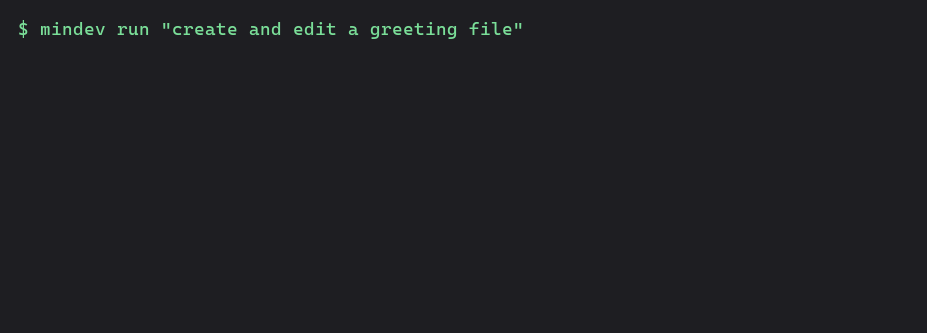
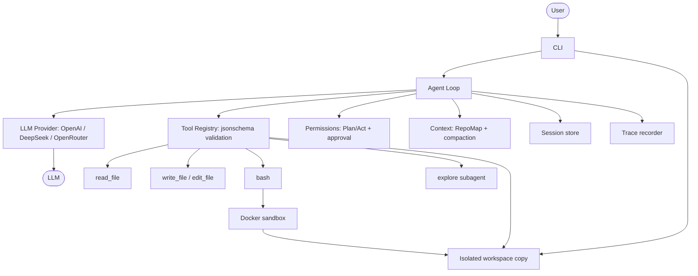

# mini-dev

一个极简 CLI coding agent（简历项目）。核心思路：**自己实现 agent 循环 / 文件编辑 / 上下文管理**，其余（CLI 界面、沙箱、diff、语法解析）复用成熟开源组件。



## 项目亮点

- **从零自研 agent 核心**：agent loop、工具系统、上下文管理、文件编辑、权限审批全部自己实现，未套用现成 Agent SDK。
- **Provider 抽象 + 流式输出**：Chat Completions + `OPENAI_BASE_URL` 一行切换 OpenAI / DeepSeek / OpenRouter；`--stream` 流式输出。
- **上下文工程**：多语言 tree-sitter RepoMap（Py/JS/Go）+ 超阈值自动 compaction（摘要即工作记忆）。
- **工具可靠性**：jsonschema 入参校验，坏参数结构化报错回灌模型自纠。
- **结构化编辑 + 回滚**：`edit_file` 精确替换（唯一性校验）+ 快照回滚；每次运行保留独立工作副本供审阅。
- **沙箱 + 权限 + Subagent**：独立工作副本 + Docker 命令沙箱 + Plan/Act 双模式 + 风险分级审批 + 只读探索子 agent。
- **评测体系**：文件系统硬校验 + LLM-as-Judge 软评分 + 通过率/平均分指标。
- **会话 + 观测**：`--session` 断点续跑、`--trace` JSONL 追踪；MCP 客户端代码保留，但隔离运行暂不允许启动宿主机 MCP server。
- **工程化**：79 个 mock 测试（不依赖 API key）、GitHub Actions CI、MIT 协议。

## 状态

- [x] Phase 0 — 项目脚手架
- [x] Phase 1 — 最小 agent loop（读文件 + 跑命令）
- [x] Phase 2 — 结构化编辑（write_file / edit_file + 快照回滚）+ 沙箱执行
- [x] Phase 3 — RepoMap 仓库上下文压缩（tree-sitter）
- [x] Phase 4 — Plan/Act 双模式 + 权限审批
- [x] Phase 5 — 打磨（MCP / 评测 / demo / CI）

## 快速开始

```bash
python -m venv .venv
.venv/Scripts/python -m pip install -e ".[dev]"   # macOS/Linux 用 .venv/bin/python
cp .env.example .env                              # 填入 OPENAI_API_KEY
.venv/Scripts/python -m pytest -q                 # 运行测试
```

## 使用

```bash
mindev run --no-bash "读一下 README.md，用一句话总结它讲了什么"
mindev run --no-bash "列出当前目录的文件"
```

> 默认模型 `gpt-5-mini`（可用 `MINIDEV_MODEL` 环境变量覆盖；`gpt-5` 系列里带 `-codex` 的模型需更高权限，普通账号无访问权限）。
> 支持任意 OpenAI 兼容后端：设 `OPENAI_BASE_URL` 即可切换 DeepSeek（`https://api.deepseek.com`）、OpenRouter（`https://openrouter.ai/api/v1`）等。
> 每次 `mindev run` 都先创建独立工作副本，源仓库不会自动改动。CLI 输出副本路径；可用 `--output-dir DIR` 指定一个尚不存在的目录，运行后检查其中的结果。副本不复制 `.env`、`.env.*`、`.git`、虚拟环境、常见缓存和文件系统链接。
> `bash` 默认在 Docker 容器中使用 POSIX `sh`，只把工作副本挂载到 `/workspace`；需先安装 Docker 并准备好本地 `python:3.13-slim` 镜像。Docker 不可用时加 `--no-bash`，文件工具仍可在副本中工作。`--sandbox local` 与 bash 同时使用会被拒绝。
> 每次运行会自动用 tree-sitter 生成 RepoMap（文件树 + 顶层函数/类 + 行号）注入系统提示词，加 `--no-repomap` 可关闭。
> 加 `--plan` 进入只读规划模式（不改文件、不跑命令，只产出方案）；默认对写文件/跑命令做交互确认，加 `--yes` 跳过确认。

> `read_file`、`write_file`、`edit_file` 只接受工作副本内的路径；拒绝 `.env`、`.env.*`（允许 `.env.example`）、副本外路径和符号链接路径。`--mcp` 与 `--checkpoint` 在隔离运行中会被拒绝。相对的 `--trace`、`--session` 路径写入副本；显式绝对路径按用户指定位置写入。

> `--usage-file api_usage.json` 可保存 API 响应实际返回的 token 用量（含探索子 Agent 与压缩摘要请求）；响应未提供完整 `usage` 时，总量标为未知。`--trace` 的 `tokens` 是字符数除以 4 的上下文估算值，不是 API 用量。固定模型的 RepoMap/压缩四组对比命令见 [validation/COMPARE.md](validation/COMPARE.md)。

### 固定模型实测（2026-10-06）

使用同一个 `deepseek-chat` 模型与 Agent 版本，在 20 道固定基线任务上各运行一次。14 道自动题的结果如下；token 是这 14 道配对题 **API 响应实际返回的总用量**，包含探索子 Agent 和压缩摘要请求。

| RepoMap | 压缩 | 自动通过 | 实际总 token |
|---|---|---:|---:|
| 关 | 关 | 9/14 | 880,075 |
| 开 | 关 | 10/14 | 521,062 |
| 关 | 开 | 7/14 | 1,149,807 |
| 开 | 开 | 11/14 | 515,222 |

这是单次采样，不能据此宣称稳定收益。另有 6 道人工题，语义 verdict 尚待真正人工审阅；其中一组第 16 题超时，记录为无效运行。完整口径、配对用量、上下文**估算值**、bad case 和原始证据见 [4.2 评测报告](validation/results/phase42-report.md)。

上表是加入运行中文件范围验证之前的历史结果；后续启用 `--allowed-file` 的运行需单独记录，不与上表混算。

加入文件范围反馈后，在同模型、同基线、同关闭 RepoMap/压缩的 14 道自动题上单次复测为 **14/14**，其中 4 题出现越界编辑并在反馈后撤回。此结果仅是一轮采样，过程和证据见 [P0 文件范围报告](validation/results/p0-file-scope-report.md)。

加入写前硬白名单后，同配置下独立运行 3 轮自动题，结果为 **14/14、14/14、13/14**（合计 41/42 有效通过）。11 次名单外写入尝试均被拒绝，42 次最终 diff 均无越界文件；10 次运行遇到拒绝，其中 9 次通过、1 次失败。失败归因与原始证据见 [硬白名单在线评测报告](validation/results/p0-hard-whitelist-online-report.md)。

同版本的 6 道人工题各运行一次，均为有效运行且指定测试通过，语义结果仍是 **6 道待人工审阅、0 道已给人工 verdict**；逐题 diff 和审阅点见 [人工题审阅包](validation/results/manual-review-packet-20261007.md)。人工题不计入上面的自动通过率。

### 编辑后自动验证

先在本机准备包含项目测试依赖的镜像（构建上下文由 `.dockerignore` 限定，不包含 `.env`）：

```bash
docker build -f Dockerfile.verify -t mindev-verify:local .
```

然后指定要运行的测试；`--verify` 可以重复。每批成功的 `write_file` / `edit_file` / `delete_file` 调用之后，测试会在挂载同一工作副本的 Docker 容器里运行一次。失败输出附在工具结果中交回 Agent，供下一轮修复；最后仍失败会明确标记为未通过验证。

```bash
mindev run --no-bash --docker-image mindev-verify:local --verify "python -m pytest tests/test_tools.py -q" "修改 read_file 并通过指定测试"
```

`--no-bash` 只移除模型可调用的 bash 工具，自动验证仍需要 Docker。镜像需预先构建；运行时容器禁用网络，测试只修改隔离副本。

限制任务可改的文件时，重复传入 `--allowed-file`。`write_file`、`edit_file`、`delete_file` 在打开文件或创建快照前检查白名单；名单外写入会直接返回拒绝错误，`read_file` 仍可读取工作区内的非敏感文件。每批成功编辑后还会比较隔离副本与任务开始时的状态，把其他途径造成的越界改动作为验证失败交回 Agent。此模式要求 `--no-bash`；仅启用文件范围限制时无需 Docker。`--verify` 指定的命令在 Docker 中运行，其写入由批次后检查发现，不受文件工具的写前白名单约束。

写前拒绝的负向测试、适用边界和回归结果见 [P0 文件硬白名单报告](validation/results/p0-hard-whitelist-report.md)。

```bash
mindev run --no-bash --allowed-file src/mindev/tools/registry.py "只修改 registry.py，拒绝重复工具名"
```

## Demo

**无需 API key**（纯本地、确定性）：

```bash
python demo.py                                # RepoMap + 脚本化 agent 跑通一次
.venv/Scripts/python -m pytest -q             # 全部测试
```

**需要 API key**（先配好 `.env`）：

```bash
mindev run --no-bash "读一下 README.md，用一句话总结"   # 无 Docker 的普通执行
mindev run --plan "实现一个 xxx 功能，先给我方案"        # 只读规划
mindev run --no-bash --output-dir ../agent-result "修改一个文件"    # 无 Docker 时只用文件工具
mindev eval                                             # 内置评测
```

## 架构



详见 [DESIGN.md](DESIGN.md)。有额度后照着 [VALIDATION.md](VALIDATION.md) 跑真实验证，拿量化数据。
